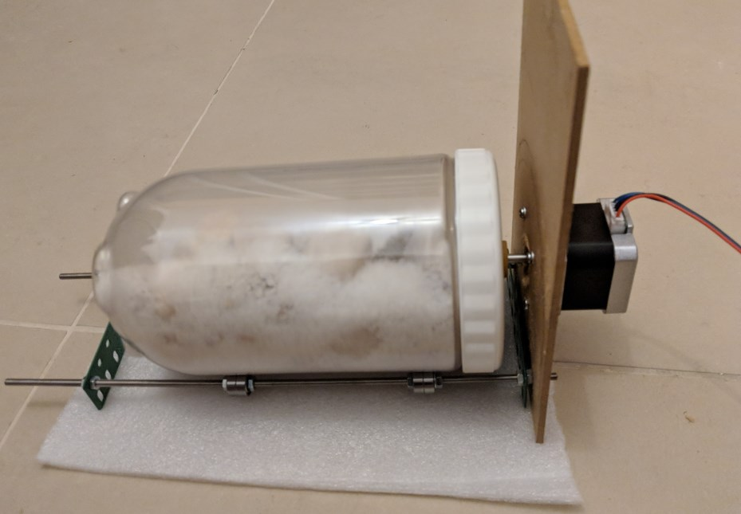

Do-It-Yourself Rock Tumbler
===========================

A simple Rock Tumbler I built from scratch in just a few hours.

## Bill of Materials

| Name | Quantity | Unit Price | Link | Comment |
|------| ---------| ---------- | ---- | ------- |
| Bipolar 1.7A 2.8V NEMA-17 Stepper Motor | 1 | $16.95 | [Pololu](https://www.pololu.com/product/2267) or [AliExpress](https://www.aliexpress.com/item/CE-certification-1pcs-4-lead-Nema17-Stepper-Motor-42-motor-Nema-17-motor-42BYGH-1-7A/32760823826.html?spm=a2g0s.9042311.0.0.27424c4dp3Ke0g )| |
| DRV8825 Motor Driver | 1 | $8.95 | [Pololu](https://www.pololu.com/product/2133) or [AliExpress](https://www.aliexpress.com/item/5pcs-lot-3D-Printer-Stepstick-Drv8825-Stepper-Motor-Driver-Reprap-4-PCB-Board-Free-shipping/32434801528.html?spm=a2g0s.9042311.0.0.27424c4dp3Ke0g) |  |
| Pixl.js Espruino Board | 1 | $44.95 | [Espruino](https://shop.espruino.com/pixljs) or [AdaFruit](https://www.adafruit.com/product/3855) |  |
| 28.8cm M4 Threaded Rod | 2 | - | | Different length possible |
| M4 Nut | 18 |  |  |  |
| M3x10 Screw | 12 | | | | 
| M3x8 Screw | 1 | | | |
| M3 Nut | 9 | | | |
| M3 Washer | 12 | | | |
| 624ZZ Bearing | 8 |  |  |  |
| Small Plastic Jar | 1 | | | |
| Small Plywood Board | 1 | | | |

You can replace the Pixl.js with a Arduino, though the built-in display make it really nice.

You also need to print 1 of each of these parts:
* [motor-mount.scad](hardware/parts/motor-mount.scad)
* [motor-hub.scad](hardware/parts/motor-hub.scad) - You may need to change the `diameter` variable to match the inner diameter of your Jar's cap (it can also be smaller)
